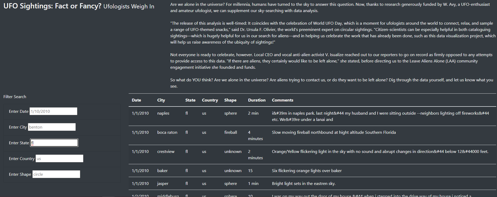

# UFOs

## Overview of Project

### Purpose
To create an interactive table of UFO sightings that can be filtered by date, city, state, country, and shape.

## Results
If someone were to visit the webpage, they will initially see the full table of data on the right and the filter search with  filter options on the left. 

The user can then enter their search criteria using the format in the search box. The user must use that format because the table is case sensitive. 

Once a filter is added the table will update automatically when the user either presses enter or clicks anywhere else on the page.

## Summary

One drawback of this new design is that if you want to remove a filter, you must refresh the page.
Two recommendations that I would give for further development would be as follows:
- The ability to remove a filter and click anywhere on the page for the table to update
- Add a dropdown ability for the shape so that user has the options available.